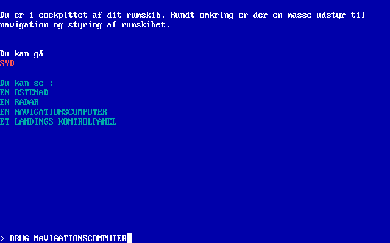

# Mission til Senturios
[English description available](README-EN.md).

Dette er et arkiv med den oprindelige sourcekode til det danske teksteventyrspil "Mission til Senturios", skrevet af Peter Ravnholt i 1989. Det blev skrevet i [Borland Turbo Basic 1.0](https://www.abandonwaredos.com/abandonware-game.php?abandonware=Borland+Turbo+Basic+1.0&gid=2602). Dette repository bliver holdt af historiske grunde (og en smule nostalgi).

* [SANSOM.BAS](SANSOM.BAS): Hovedprogrammet.
* [SDATA1.DAT](SDATA1.DAT): Datafil med lokationer.
* [SDATA2.DAT](SDATA2.DAT): Datafil med genstande.
* [HELP.TXT](HELP.TXT): Hjælp og instruktioner til spillet.
* [MISSION.TXT](MISSION.TXT): Intro til spillets handling.
* [HISTORY.TXT](HISTORY.TXT): Opdigtede hovedbegivenheder i verden fra år 2000 og frem, som baggrund for handlingen. Meget underholdende læsning (og tankevækkende rigtigt ramt i flere tilfælde).

[Besøg FableTree Production's nostalgiside](https://fabletreeproductions.dk/da/nostalgia) for mere information og mulighed for at køre spillet i browseren.